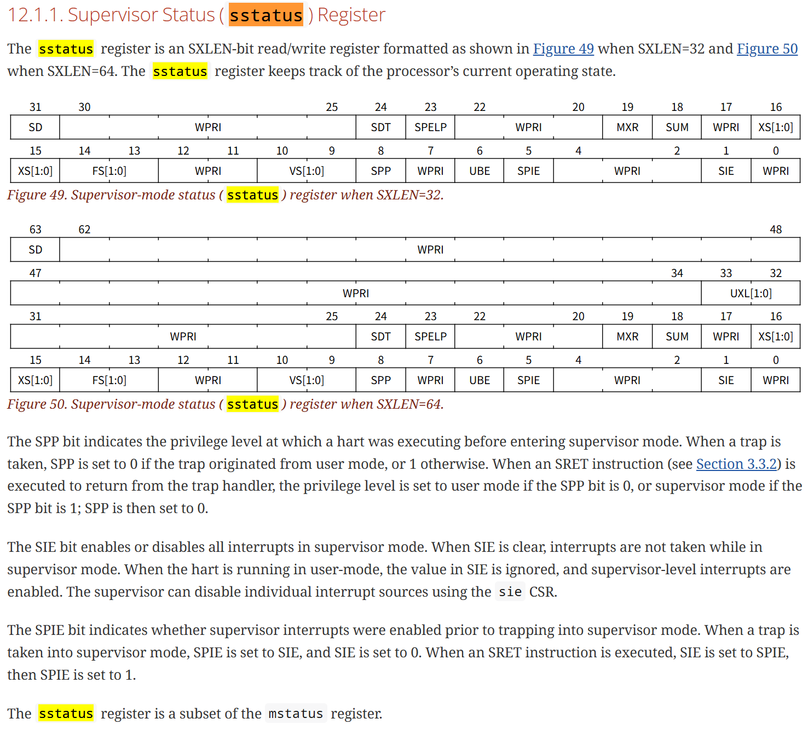

# lab3

## 编程作业

跟着文档一步一步走就知道了 每个部分具体是干什么的，然后就在要求位置进行拦截，记录。

## 简答作业

### 1

- 写地址0
    - 报错: PageFault in application, bad addr = 0x0, bad instruction = 0x804003a4, kernel killed it.
- 运行sret S特权指令
    - 报错: IllegalInstruction in application, kernel killed it.
- 访问sstatus寄存器
    - 报错: IllegalInstruction in application, kernel killed it.

### 2

1. 刚进去__restore时，sp代表了当前内核栈的栈顶指针。
    - 场景一: 系统调用收尾工作。
    - 场景二: 系统初始化时，利用它从 S 态 返回 U 态。
2. sstatus，sepc，sscratch
    - sscratch: 在后面用于保存当前任务内核栈顶指针。
    - sepc: 用于保存trap的指令地址。
    - sstatus: 保存了当前任务的一系列状态，例如终端
        - 
3. x2寄存器 是 用户栈顶指针，在后面保存；x4寄存器用户不使用？
4. 交换后，sp指向用户栈顶，sscratch指向该任务对应的内核态栈顶。
5. srat
    - riscv64 设计时，要求该指令修改 sstatus 标记位？
6. sp指向内核态栈顶，sscratch指向用户态栈顶。
7. ecall

**荣誉准则**
----------------
.. warning::
    
    请把填写了《你的说明》的下述内容拷贝到的到实验报告中。
    否则，你的提交将视作无效，本次实验的成绩将按“0”分计。

1. 在完成本次实验的过程（含此前学习的过程）中，我曾分别与 **以下各位** 就（与本次实验相关的）以下方面做过交流，还在代码中对应的位置以注释形式记录了具体的交流对象及内容：

    无。

2. 此外，我也参考了 **以下资料** ，还在代码中对应的位置以注释形式记录了具体的参考来源及内容：

    无。

3. 我独立完成了本次实验除以上方面之外的所有工作，包括代码与文档。
我清楚地知道，从以上方面获得的信息在一定程度上降低了实验难度，可能会影响起评分。

4. 我从未使用过他人的代码，不管是原封不动地复制，还是经过了某些等价转换。
我未曾也不会向他人（含此后各届同学）复制或公开我的实验代码，我有义务妥善保管好它们。
我提交至本实验的评测系统的代码，均无意于破坏或妨碍任何计算机系统的正常运转。
我清楚地知道，以上情况均为本课程纪律所禁止，若违反，对应的实验成绩将按“-100”分计