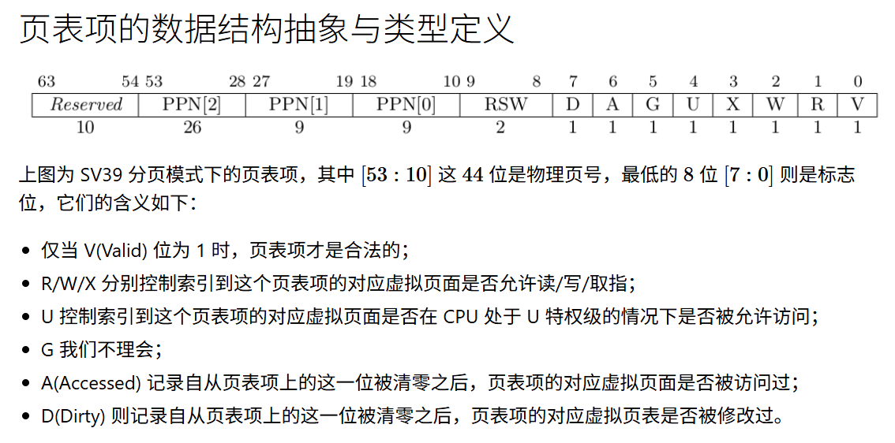

# report

## 编程练习

主要考虑了 用哪个 memeset实现，以及 start，end 转换问题。

## 问答作业

### 1

### 2

- 请问哪些异常可能是缺页导致的？
    - 页目录项不存在异常。
- 发生缺页时，描述相关重要寄存器的值，上次实验描述过的可以简略。
    - sscratch 指向 TRAP_CONTEXT_BASE
    - pc 指向 TRAMPOLINE 即 __alltraps
    - x[17] 设置为 异常号
    - x[10,11,12] 设置为 参数
        - 其中有 发生缺页指令地址。
- 这样做有哪些好处？
    - 初始化时简单，只用分配页表项，不用拷贝数据。
    - 初始时 只用分配一级页表项，二三级 可以不用处理。
- 处理 10G 连续的内存页面，对应的 SV39 页表大致占用多少内存 (估算数量级即可)？
    - 1e6B
- 请简单思考如何才能实现 Lazy 策略，缺页时又如何处理？描述合理即可，不需要考虑实现。
    - 添加 内存和外存标记位
    - 缺页时，先找到第三级PageEntry，
        - 标记位 为内存 直接读取。
        - 标记位 为外存 从外存读到内存，修改标记位和物理页号。
- 此时页面失效如何表现在页表项(PTE)上？
    - 合法位为 invalid 但是 标记位 为 在外存。

### 3

- 在单页表情况下，如何更换页表？
    - 直接更换
- 单页表情况下，如何控制用户态无法访问内核页面？
    - 页表项 中 U为false
- 单页表有何优势？
    - 访问Trap，不用切换到内核页表中，切换到内核态可以直接执行Trap处理逻辑。
- 双页表实现下，何时需要更换页表？假设你写一个单页表操作系统，你会选择何时更换页表（回答合理即可）？
    - 访问内核时。
    - 切换任务时。

**荣誉准则**
----------------
1. 在完成本次实验的过程（含此前学习的过程）中，我曾分别与 **以下各位** 就（与本次实验相关的）以下方面做过交流，还在代码中对应的位置以注释形式记录了具体的交流对象及内容：

    无

2. 此外，我也参考了 **以下资料** ，还在代码中对应的位置以注释形式记录了具体的参考来源及内容：

    无

3. 我独立完成了本次实验除以上方面之外的所有工作，包括代码与文档。
我清楚地知道，从以上方面获得的信息在一定程度上降低了实验难度，可能会影响起评分。

4. 我从未使用过他人的代码，不管是原封不动地复制，还是经过了某些等价转换。
我未曾也不会向他人（含此后各届同学）复制或公开我的实验代码，我有义务妥善保管好它们。
我提交至本实验的评测系统的代码，均无意于破坏或妨碍任何计算机系统的正常运转。
我清楚地知道，以上情况均为本课程纪律所禁止，若违反，对应的实验成绩将按“-100”分计。