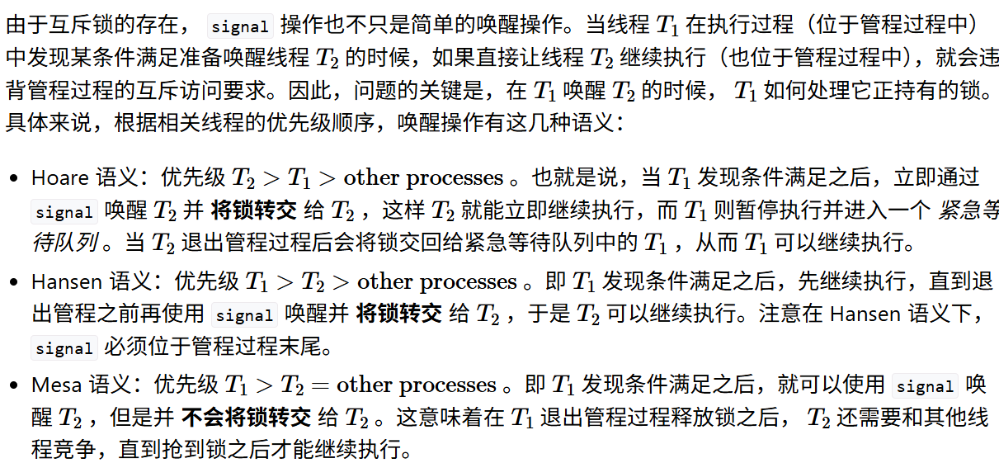

# 编程作业

照着题目说的做 + 测试样例挑bug。

# 问答作业

1. 需要回收的资源有哪些?
    1. 每个线程的内核栈，
    2. mutex，信号量，条件变量或信号的等待队列中。
        1. 不需要，上面东西drop的时候会默认 drop掉Arc\<TaskControlBlock\>
2. 像文章提过的那样，
    1. 带有loop的是 基于Mesa语义的实现方式。
    2. 不带loop的是 基于Hansen语义的实现方式，确保了锁的正确转交。
    3. 导致的问题：
        1. 不太清楚。